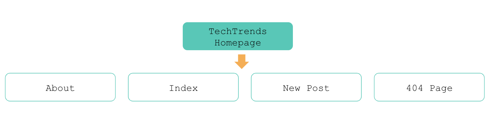
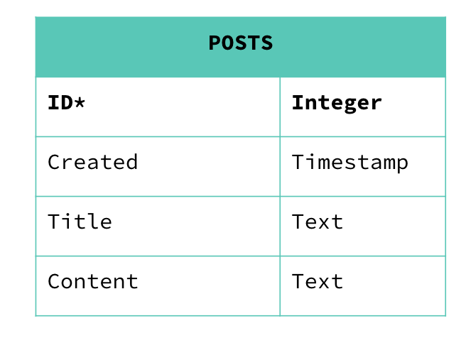
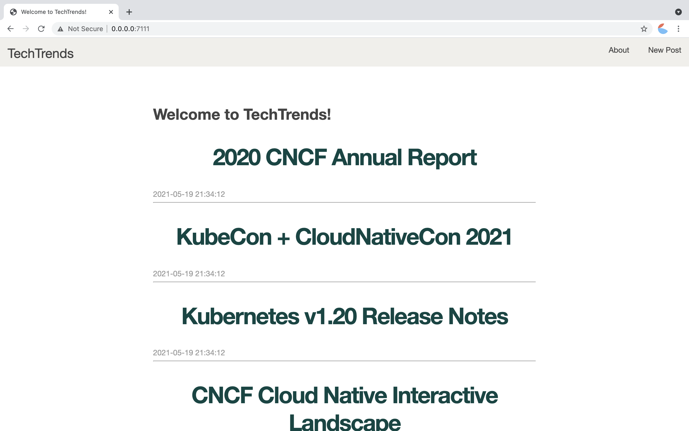
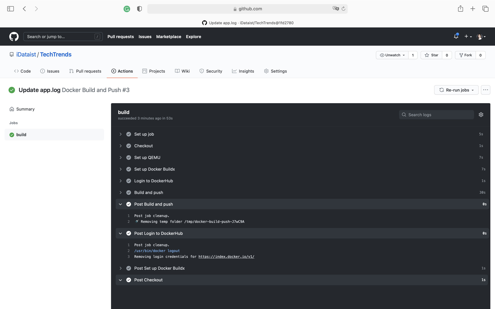
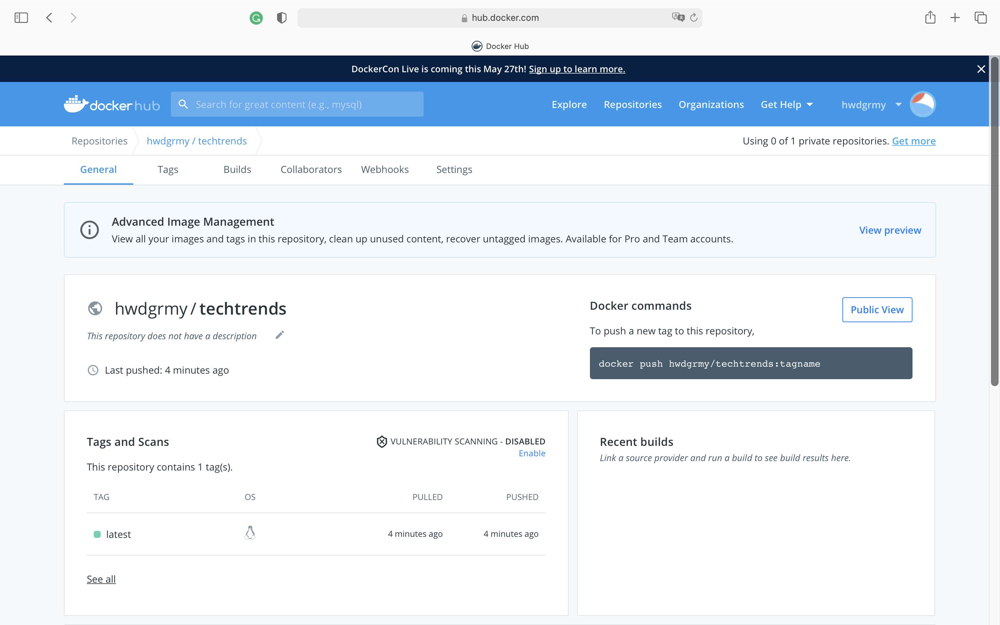
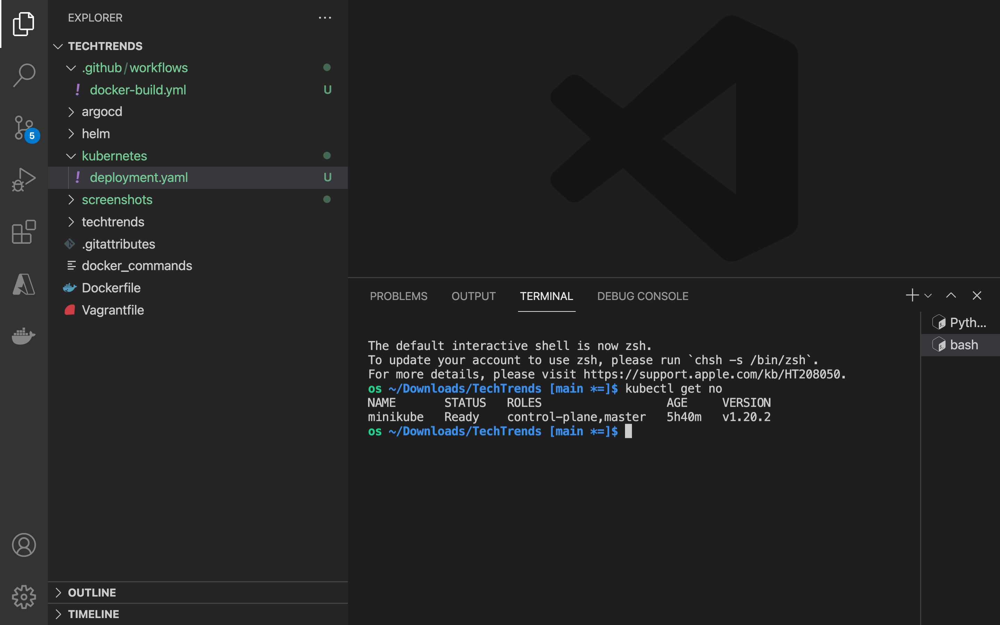
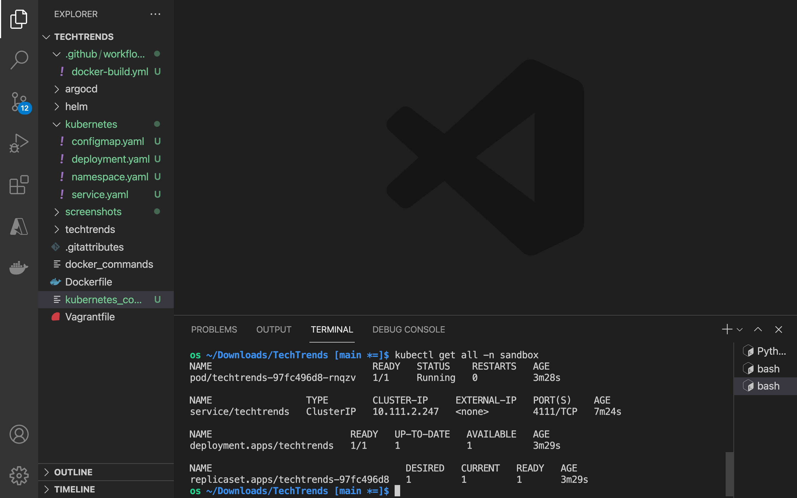
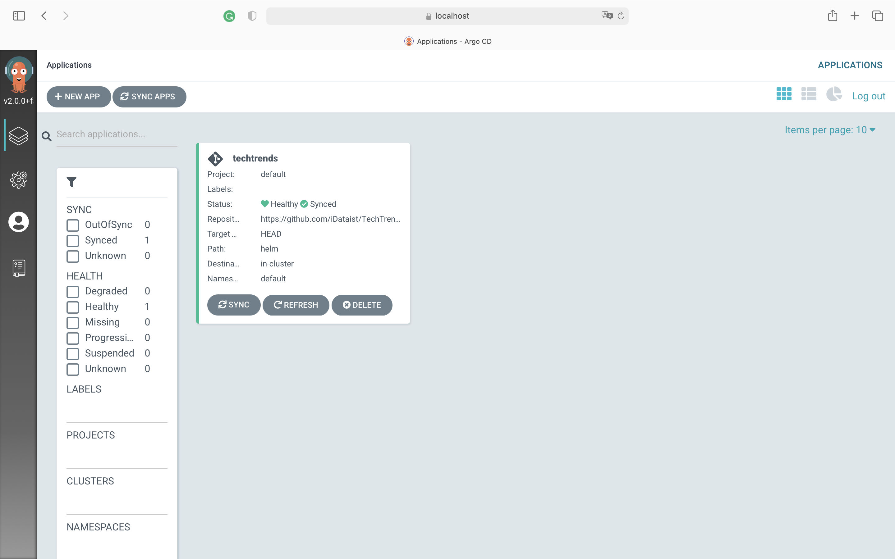
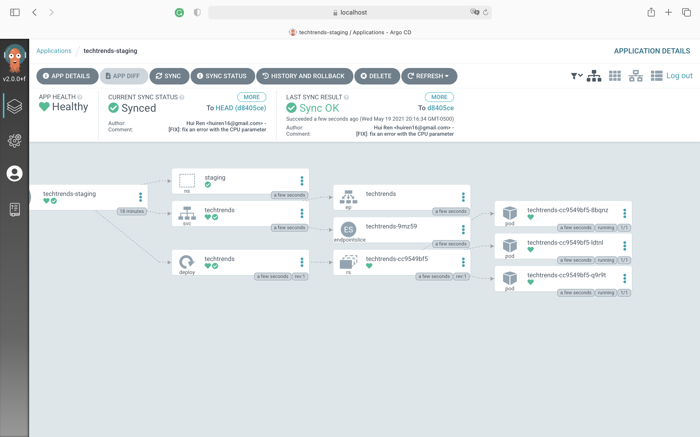
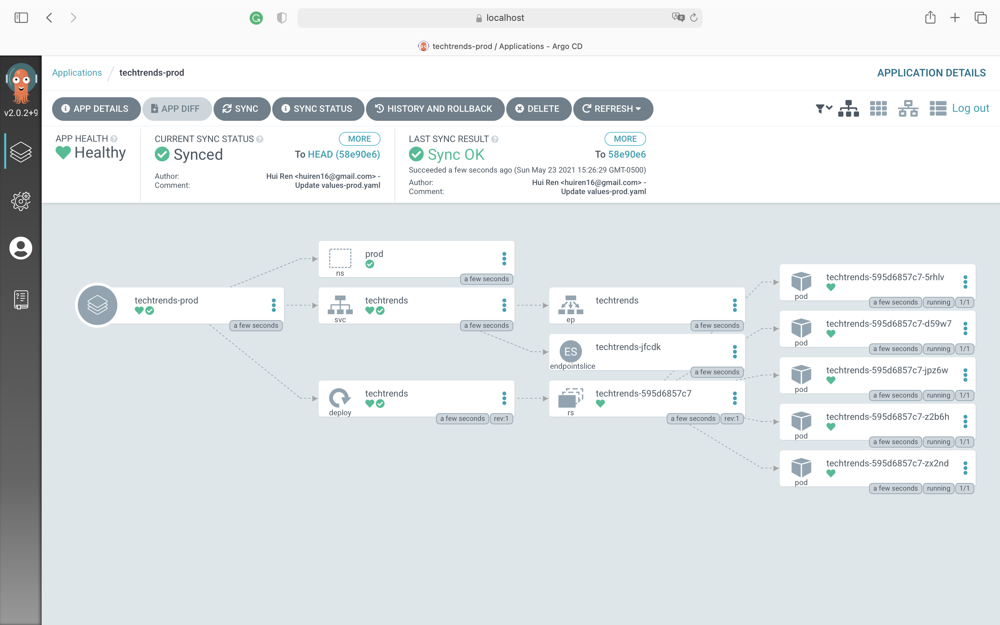

# TechTreds

[](https://github.com/iDataist/TechTrends/actions/workflows/techtrends-dockerhub.yml)

## Overview
TechTrends is an online website used as a news sharing platform, that enables consumers to access the latest news within the cloud-native ecosystem. In addition to accessing the available articles, readers are able to create new media articles and share them. The first prototype of the TechTrends website was built. In this project, I packaged and deployed TechTrends to Kubernetes using a CI/CD pipeline.

The web application is written using the Python Flask framework. It uses SQLite, a lightweight disk-based database to store the submitted articles.Below you can examine the main components of the firsts prototype of the application:


Additionally, the initial sitemap of the website can be found below:


Where:

- About page - presents a quick overview of the TechTrends site
- Index page - contains the content of the main page, with a list of all available posts within TechTrends
- New Post page - provides a form to submit a new post
- 404 page - is rendered when an article ID does not exist is accessed

And lastly, the first prototype of the application is storing and accessing posts from the "POSTS" SQL table. A post entry contains the post ID (primary key), creation timestamp, title, and content. The "POSTS" table schema can be examined below:


## Prerequisites
1. [Install Docker](https://docs.docker.com/get-docker/)
2. [Set up a DockerHub account](https://hub.docker.com/)
3. [Set up `kubectl`](https://rancher.com/docs/rancher/v2.x/en/cluster-admin/cluster-access/kubectl/)
4. [Set up `minikube`](https://minikube.sigs.k8s.io/docs/start/)
5. [Set up `ArgoCD`](https://argoproj.github.io/argo-cd/getting_started/#1-install-argo-cd)

## Getting Started
This repository file structure can be found below:
```
techtrends/
├── README.md
├── __init__.py
├── app.py
├── init_db.py
├── requirements.txt
├── schema.sql
├── static
│   └── css
│       └── main.css
└── templates
    ├── 404.html
    ├── about.html
    ├── base.html
    ├── create.html
    ├── index.html
    └── post.html
```
Where:

- README.md contains the main steps of how to execute the TechTrends application
- __init__.py is a reserved method used to indicate that a directory is a Python package
- app.py contains the main logging of the TechTrends application
- init_db.py is a file that is used to initialize the posts database with a set of articles
- requirements.txt contains a list of packages that need to be installed before running the TechTrends application
- schema.sql outlines the posts database schema
- static/ folder contains the CSS files
- templates/ folder outlines the HTML structure of the TechTrends application

Within the project folder you will notice some extra folders and files that are related to the CI/CD pipeline.

- argocd - folder contains the ArgoCD manifests
- helm - folder contains the Helm chart files
- kubernetes - folder contains Kubernetes declarative manifests
- Vagrantfile - the file contains the configuration for the vagrant box
- *_commands - the files contain Docker, Kubernetes and ArgoCD commands 

To run this application, follow these steps:

- Initialize the database by using the python init_db.py command. This creates or overwrites (if the file already exists) the database.db file that is used to store and access the available posts.
- Run the TechTrends application by using the `python app.py` command. The application is running on port 3111 and you can access it by querying the http://127.0.0.1:3111/ endpoint.

## CI/CD Pipeline
### Packing the Applicaiton with Docker
I built a Dockerfile to package the TechTrends application. You can build the Docker image for the TechTrends application and test the TechTrends Docker image locally by running the commands in `docker_commands`. The application can be accessed at `http://localhost:7111`.


### Continuous Integration with GitHub Actions
I used GitHub Actions to build, tag, and push the TechTrends Docker image to DockerHub. I created the `techtrends-dockerhub.yml` configuration file, which is in the `.github/workflows/` directory. The file needs DockerHub Tokens and encrypted GitHub secrets to login into DockerHub and to push new images. To set up these credentials refer to the following resources:
- [Create DockerHub Tokens](https://www.docker.com/blog/docker-hub-new-personal-access-tokens/)
- [Create GitHub encrypted secrets](https://docs.github.com/en/actions/reference/encrypted-secrets)

As a result, you should have a functional GitHub Action that will construct a new image with every new commit to the main branch. 


### Deploying a Kubernetes Cluster and Deploy the TechTrends Application
To deploy the Kubernetes cluster, run `minikube start`. Verify if the cluster is operational by evaluating if the node in the cluster is up and running. You can use the `kubectl get no` command.

I created the declarative Kubernetes manifests that are in the `kubernetes` directory. You can release the application to the sandbox environment by running the commands in `kubernetes_commands`. Run `kubectl get all -n sandbox` to check the status of the deployment. 

### Continuous Delivery with ArgoCD
I first built a Helm Chart to template and release the application to multiple environments. You can see a collection of parametrized YAML manifests that use an input values file to generate valid Kubernetes objects in the `helm` directory. 

I then created the following ArgoCD application manifests in the `argocd` directory to deploy TechTrends to staging and production environments:

    helm-techtrends-staging.yaml
        name: techtrends-staging
        values file: values-staging.yaml
    helm-techtrends-prod.yaml
        name: techtrends-prod
        values file: values-prod.yaml

To deploy ArgoCD, run the following commands:
```
kubectl create namespace argocd
kubectl apply -n argocd -f https://raw.githubusercontent.com/argoproj/argo-cd/stable/manifests/install.yaml
```
To access ArgoCD through local browser, run `kubectl port-forward svc/argocd-server -n argocd 8080:443`. To obtain the password to login, run the following commands:
```
kubectl config set-context --current --namespace=argocd
kubectl -n argocd get secret argocd-initial-admin-secret -o jsonpath="{.data.password}" | base64 -d
```
Login to `localhost:8080` with the user name `admin` and the password obtained through the previous step. 


To release the application to staging and production environments using the templated manifests from the Helm chart, run the following commands:
```
kubectl config set-context --current --namespace=staging
kubectl apply -f helm-techtrends-staging.yaml

kubectl config set-context --current --namespace=prod
kubectl apply -f helm-techtrends-prod.yaml
```

